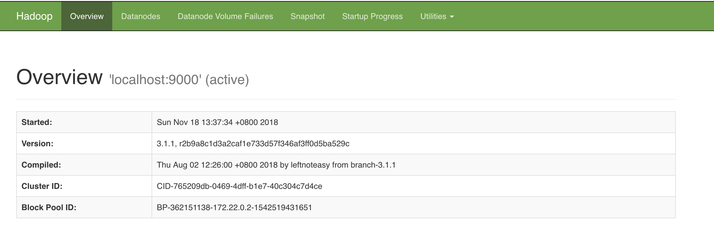
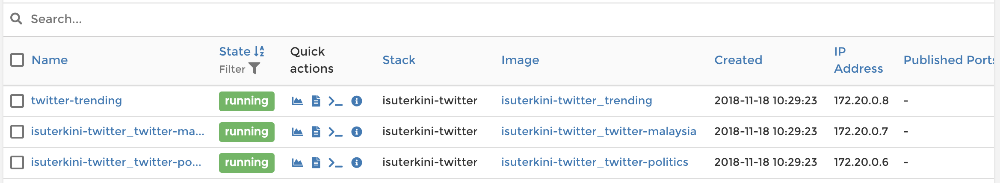
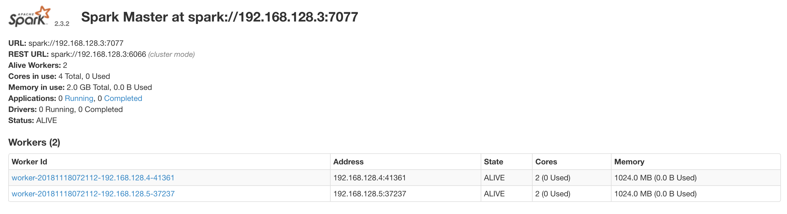

# Pyspark-ML
Gathers data science and machine learning problem solving using PySpark and Hadoop.


## Covered

0. Test Pyspark
1. Text classification IMDB dataset using logistic regression
2. Text classification IMDB dataset using multinomial
3. Topic Modelling TFIDF + LDA
4. Word Vector
5. Read Iris csv from Hadoop DFS
6. PCA on Iris dataset
7. MNIST feed-forward sparkflow
8. MNIST CNN sparkflow
9. MNIST RNN-LSTM sparkflow
10. Fashion-MNIST Inception v1 sparkflow

## How-to Notebook

1. Run docker compose,
```bash
compose/build
```

Or you can choose cluster mode,
```bash
docker-compose -f docker-compose-cluster.yml up --build --remove-orphans
```

2. Visit [localhost:8089](http://localhost:8089) for passwordless jupyter notebook.

## How-to Hadoop

Check Hadoop health, [localhost:9870](http://localhost:9870)



Hadoop DFS Web UI, [localhost:9870/explorer.html#/](http://localhost:9870/explorer.html#/)


Hadoop Node Manager, [localhost:8042/node](http://localhost:8042/node)



## How-to Spark-cluster

If success using cluster mode,
```text
slave_2   | 2018-11-18 07:57:59 INFO  Worker:54 - Successfully registered with master spark://192.168.128.2:7077
slave_1   | 2018-11-18 07:58:10 INFO  Worker:54 - Successfully registered with master spark://192.168.128.2:7077
```

Check Spark health, [localhost:8080](http://localhost:8080)


